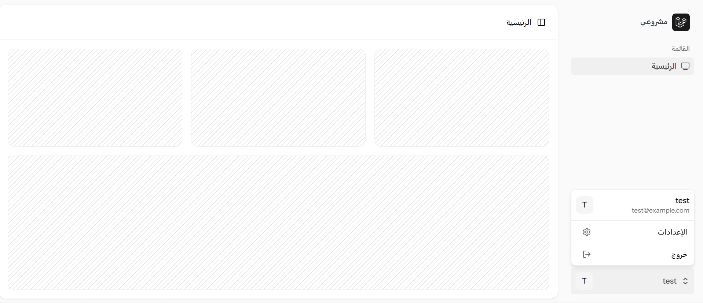

# Laravel 12 + Vue 3 + Inertia.js RTL Starter Kit

🚀 **A modern, ready-to-use starter kit for building RTL (right-to-left) Laravel applications with Vue 3 and Inertia.js.**

⚠️ **This project is currently under development.** Feel free to open issues or pull requests to contribute.


This starter kit is based on the official [Laravel Vue Starter Kit](https://github.com/laravel/vue-starter-kit), providing a fully integrated Laravel 12 + Vue 3 SPA experience with right-to-left (RTL) to support arabic language.

---

## Screenshots

Here are some screenshots of the starter kit in action:

### Dashboard




--

## Features

- ✅ Based on the official Laravel Vue Starter Kit
- ✅ Laravel 12 with Inertia.js
- ✅ Vue 3 Composition API
- ✅ Tailwind CSS with RTL support (`tailwindcss-rtl`)
- ✅ Inertia-powered routing between Vue pages
- ✅ Ready-to-use authentication scaffolding (Laravel)
- ✅ Example CRUD pages
- ✅ Modular Vue components
- ✅ Clean, production-ready structure

---

## Getting Started

### Requirements

- PHP 8.2+
- Node.js 18+
- Composer

### Installation

```bash
git clone https://github.com/harranali/laravel-vue-starter-kit-rtl
cd laravel-vue-starter-kit-rtl
cp .env.example .env
composer install
npm installnpm
php artisan key:generate
php artisan migrate
npm run dev
```


## Documentation for the Official Laravel vue starter kit

Documentation for Laravel starter kits can be found on the [Laravel website](https://laravel.com/docs/starter-kits).


## License

The Laravel + Vue  RTL starter kit is open-sourced software licensed under the MIT license.


